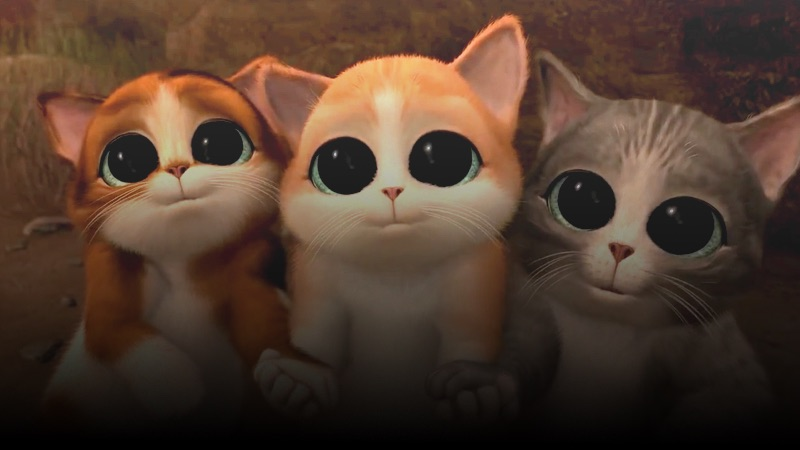

Cat Academy
===========

We are [Robocat](http://robo.cat/), a product company from Copenhagen.
Over years we have built apps, games and even hardware.
We learned a lot while doing this; also from our mistakes.
We are launching **Cat Academy** to share our experience with you. Here’s the first course we’re offering:

Help! My App Needs a Back-end!

Back-end <abbr title="application programming interface">API</abbr> development  <small>for front-end developers</small>
=================================================

<i>
June 11—12th
&nbsp;&bull;&nbsp;
10/10 seats left
&nbsp;&bull;&nbsp;
<abbr title="Danish krone">DKK</abbr><strong> 3.141,–</strong>
</i>

<a style="
    background-color: black; color: white; border-radius: 99px;
    padding: 0.5em 1em 0.5em 1em;
    line-height: 2.3em;
    text-decoration: none;"href="#">
   Buy ticket
</a>

During the two-day course you will develop
a small <abbr title="application programming interface">API</abbr> server for a turn-based multiplayer game.
You will learn to use the following technologies and tools:

 * Python programming language,
 * Flask—web micro-framework,
 * SQLAlchemy—object-relational mapping library,
 * Heroku—app-hosting platform.

You will not become an expert in these technologies, but you
will learn enough to be able to use them to create simple
<abbr title="application programming interface">API</abbr> servers, and be prepared enough to be able to study further
on your own.

Instructor
----------

[Vladimir Keleshev](https://twitter.com/keleshev) is a software developer at Robocat.
He worked on back-ends of online games, such as
[Gameglobe](http://gameglobe.com/) and
[Wordbase](http://www.wordbaseapp.com/).
He also authored some open-source projects, such as
[docopt](https://github.com/docopt/docopt) and
[schema](https://github.com/keleshev/schema).
As a hobby he helps teaching
a [Python course](http://www2.compute.dtu.dk/courses/02819/)
at Technical University of Denmark as a teaching assistant.
He co-organizes [Python meetup](http://pycon.dk/) as well as
[Polyglots meetup](http://www.polyglots.dk/) in Copenhagen area.
Occasionally he speaks at [conferences](http://youtu.be/pXhcPJK5cMc)
and [meetups](http://youtu.be/1h1mM7VwNGo).

Price
-----

We are offering our very first course for a special early-cat price of
<i><abbr title="Danish krone">DKK</abbr>&nbsp;**3.141,–**</i>
for the two-day course. Breakfast and lunch is on us.

Prerequisites
-------------

Here are the things that are necessary to know in before
joining this course:

 * programming in an *object-oriented* style, in a language such as
   JavaScript, Objective-C, Java, C# or other;
 * *version-control* systems, such as <abbr title="Subversion">SVN</abbr>, Mercurial or Git;
 * *<abbr title="Structured Query Language">SQL</abbr>* and relational databases,
 * *Unix* operating system (e.g. <abbr>OS X</abbr> or Linux) and its *shell*.

You will need to bring a laptop with <abbr>OS X</abbr> or Linux operating
system installed. If you have Windows you can use
[VirtualBox](http://www.psychocats.net/ubuntu/virtualbox)
to install Linux alongside Windows in a sandbox environment.
But remember that you still need basic knowledge of Unix and shell.

Unlike the title suggests, you do not need to be a front-end
developer to join this course.

Preliminary Schedule
----------

### Thursday, June 11th

* 09:30 Breakfast
* 12:00 Lunch
* 14:00 Coffee break
* 16:00 Coffee break
* 16:30 Over and out

### Friday, June 12th

* 09:30 Breakfast
* 12:00 Lunch
* 14:00 Coffee break
* 16:00 Coffee break
* 16:30 Retrospective and feedback

Location
--------

<!--a href="https://www.google.dk/maps/place/Pilestr%C3%A6de+43,+1112+K%C3%B8benhavn+K/@55.6811462,12.579215,17z/data=!3m1!4b1!4m2!3m1!1s0x46525310a82927d1:0xa3f8d542574de862?hl=en">
  

</a-->

<iframe style="margin-left: -51px" src="https://www.google.com/maps/embed?pb=!1m14!1m8!1m3!1d2249.4510110893502!2d12.579214999999998!3d55.6811462!3m2!1i1024!2i768!4f13.1!3m3!1m2!1s0x46525310a82927d1%3A0xa3f8d542574de862!2sPilestr%C3%A6de+43%2C+1112+K%C3%B8benhavn+K!5e0!3m2!1sen!2sdk!4v1432124533841" width="800" height="400" frameborder="0" style="border:0"></iframe>

**Robocat**  
Pilestraede 43, 2nd Floor 
1112 Copenhagen 
Denmark

<!--a href="//twitter.com/robocat">
   @catacademy</a> 
<a href="//facebook.com/robocat">
/catacademy</a> 
<a href="mailto://hello@robo.cat">
hello@catacademy.dk</a>

<table>
    <a href="//twitter.com/robocat">
        <tr>
            <td>

               
            </td>
            <td>
                 @catacademy
            </td>
        </tr>
    </a>
    <tr>
        <a href="//twitter.com/robocat">
            <td>

                
            </td>
            <td>
                 hello@catacademy.dk
            </td>
        </a>
    </tr>
</table-->

<form id="signup_form">
  <h2>Subscribe to Cat Academy newsletter</h2>
  <input type="email" name="email" id="email"
         placeholder="Your email" style="
    background-color: white; color: black;
    border-radius: 99px 0 0 99px;

    padding: 0.5em 2em 0.5em 1em;
    border: none;
    outline: none;
">
  <input type="submit" id="subscribe" value="Subscribe" name="subscribe"
         style="
    background-color: black; color: white; border-radius: 99px;
    padding: 0.5em 1em 0.5em 1em;
    margin-left: -1em;
    cursor: pointer;
">
</form>

