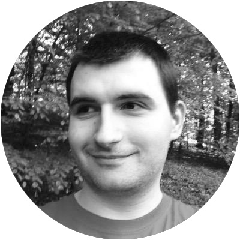

  

<!--http://www.123rf.com/photo_4960686_laurel-wreath.html-->

Cat Academy
===========

We are [Robocat](http://robo.cat/), a product company from Copenhagen.
Over years we have built apps, games and even hardware.
We learned a lot while doing this; also from our mistakes.
We are launching **Cat Academy** to share our experience with you. Here’s the first course we’ve made:

Back-end API development  <small>for front-end developers</small>
=================================================

<i>A two-day course for DKK <strong>3.141,– </strong></i>

<a style="
    background-color: black; color: white; border-radius: 99px;
    padding: 0.5em 1em 0.5em 1em;
    line-height: 2.3em;
    text-decoration: none;"href="#">
   Buy ticket
</a>

During the two-day course you will develop
a small API server for a turn-based multiplayer game.
You will learn to use the following technologies and tools:

 * Python programming language,
 * Flask—web micro-framework,
 * SQLAlchemy—object-relational mapping library,
 * Heroku—app-hosting platform.

You will not become an expert in these technologies, but you
will learn enough to be able to use them to create simple
API servers, and be prepared enough to be able to study further
on your own.

Instructor
----------

[Vladimir Keleshev](https://twitter.com/keleshev) is a software developer at Robocat.
He worked on back-ends of online games, such as
[Gameglobe](http://gameglobe.com/) and
[Wordbase](http://www.wordbaseapp.com/).
He also authored some open-source projects, such as
[docopt](https://github.com/docopt/docopt) and
[schema](https://github.com/keleshev/schema).
As a hobby he helps teaching
a [Python course](http://www2.compute.dtu.dk/courses/02819/)
at Technical University of Denmark as a teaching assistant.
He co-organizes [Python meetup](http://pycon.dk/) as well as
[Polyglots meetup](http://www.polyglots.dk/) in Copenhagen area.
Occasionally he speaks at [conferences](http://youtu.be/pXhcPJK5cMc)
and [meetups](http://youtu.be/1h1mM7VwNGo).

Location
--------

**Robocat**

Pilestraede 43, 2nd Floor 
1112 Copenhagen 
Denmark

Price
-----

We are offering our first course for a very special early-cat price of
<i>DKK&nbsp;**3.141,–**</i>
for the two-day course. Breakfast and lunch is on us.

Prerequisites
-------------

Here are the things that are necessary to know in before
joining this course:

 * programming in an *object-oriented* style, in a language such as
   JavaScript, Objective-C, Java, C# or other;
 * *version-control* systems, such as SVN, Mercurial or Git;
 * *SQL* and relational databases,
 * *Unix* operating system (e.g. OS X or Linux) and its *shell*.

You will need to bring a laptop with OS X or Linux operating
system installed. If you have Windows you can use
[VirtualBox](http://www.psychocats.net/ubuntu/virtualbox)
to install Linux alongside Windows in a sandbox environment.
But remember that you still need basic knowledge of Unix and shell.

Unlike the title suggests, you do not need to be a front-end
developer to join this course.

Draft Schedule
----------

This will later include actual content.

### Tuesday, May 26th

*  9:30 Breakfast
* 12:00 Lunch
* 14:00 Coffee break
* 16:00 Coffee break
* 16:30 Over and out

### Wednesday, May 27th

Self-practice day

### Thursday, May 28th

*  9:30 Breakfast
* 12:00 Lunch
* 14:00 Coffee break
* 16:00 Coffee break
* 16:30 Retrospective and feedback

Contact
-------

<a href="//twitter.com/robocat">
   @catacademy</a> 
<a href="//facebook.com/robocat">
/catacademy</a> 
<a href="mailto://hello@robo.cat">
hello@catacademy.dk</a>

      

      

